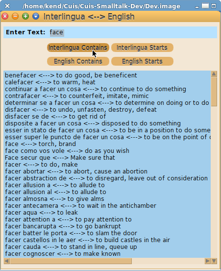

Cuis-IA-EN-Dictionary
=====================

Interlingua &lt;--> English lookup window

Tested in Cuis 7.5 Revision 7262.


This code was the inspiration for the SamplePackage tutorial:

  https://github.com/DrCuis/How-to-guides/blob/main/300-Packaging/README.md


To load the package
````Smalltalk
	Feature require: #'IA-EN-Dictionary'
````

Then execute
````Smalltalk
    IEDictWindow open.
````

Or use the World menu->Open command


